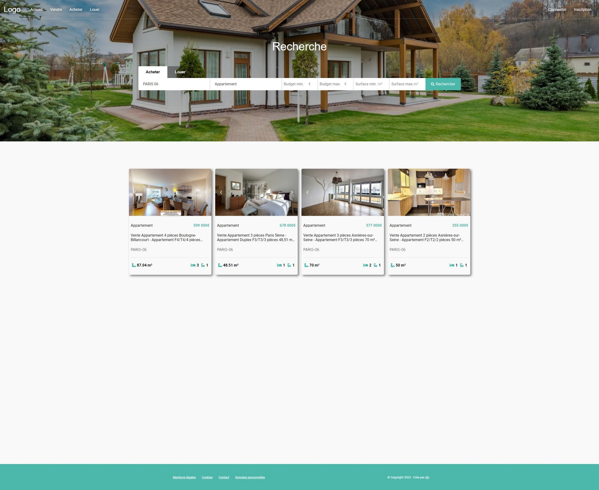

<div id="top"></div>
<br />
<div align="center">
  <h3 align="center">Site d'annonces immobilières</h3>

  <p align="center">
    URL: https://immobilier.anthonydragun.fr/
  </p>
</div>

<!-- ABOUT THE PROJECT -->
## À propos

<details class="images">
  <summary>CLICK HERE TO SHOW IMAGES</summary>
  
  
  
  
  
</details>

Projet personnel de mise en place d'une application web d'annonces immobilières qui utilise une API avec les fonctionnalités de base (CRUD) pour ajouter, supprimer, modifier et obtenir une annonce.

Ce projet est développé sur Next.js (SEO, SSR, back-end NodeJS intégré). Le système d'authentification créé avec Firebase permet aux utilisateurs de créer un compte, et de se connecter pour ensuite pouvoir poster une annonce (annonces qui sont dans une base de données Firestore). Une fois une annonce postée, l'utilisateur peut ensuite la modifier ou la supprimer depuis la page "Mon compte".

Le système de recherche utilise Redux pour garder en mémoire les paramètres de recherche choisis par l'utilisateur, même s'il quitte ou rafraichit la page.

Côté back-end, l'API gère les requêtes POST, GET, PUT et DELETE. (Le fichier data/schemas.js indique les différents paramètres à inclure dans chaque requête).

- POST: Permet de créer une annonce par soi-même, mais également d'importer une annonce depuis le site https://seloger.com/.
- GET: Permet de récupérer et lire une annonce ou des annonces par: son ID, l'ID de l'utilisateur, des filtres (Type d'offre, type de propriété, ville).
- PUT: Permet de modifier une annonce par son ID.
- DELETE: Permet de supprimer une annonce par son ID.

LE PROJET EST TOUJOURS EN WIP.

### Frameworks, Librairies & APIs

Ce projet utilise:

* [React.js](https://reactjs.org/)
* [Next.js](https://nextjs.org/)
* [Styled-Components](https://styled-components.com/)
* [Firebase (Authentication et Firestore)](https://firebase.google.com/)
* [Redux (Toolkit, React-Redux, Redux-Persists)](https://redux.js.org/)
* Axios
* [Font-Awesome](https://fontawesome.com/)
* [Fastest Validator](https://www.npmjs.com/package/fastest-validator)

<p align="right">(<a href="#top">back to top</a>)</p>


## Getting Started

First, run the development server:

```bash
npm run dev
# or
yarn dev
```

Open [http://localhost:3000](http://localhost:3000) with your browser to see the result.

You can start editing the page by modifying `pages/index.js`. The page auto-updates as you edit the file.

[API routes](https://nextjs.org/docs/api-routes/introduction) can be accessed on [http://localhost:3000/api/hello](http://localhost:3000/api/hello). This endpoint can be edited in `pages/api/hello.js`.

The `pages/api` directory is mapped to `/api/*`. Files in this directory are treated as [API routes](https://nextjs.org/docs/api-routes/introduction) instead of React pages.

## Learn More

To learn more about Next.js, take a look at the following resources:

- [Next.js Documentation](https://nextjs.org/docs) - learn about Next.js features and API.
- [Learn Next.js](https://nextjs.org/learn) - an interactive Next.js tutorial.

You can check out [the Next.js GitHub repository](https://github.com/vercel/next.js/) - your feedback and contributions are welcome!

## Deploy on Vercel

The easiest way to deploy your Next.js app is to use the [Vercel Platform](https://vercel.com/new?utm_medium=default-template&filter=next.js&utm_source=create-next-app&utm_campaign=create-next-app-readme) from the creators of Next.js.

Check out our [Next.js deployment documentation](https://nextjs.org/docs/deployment) for more details.
